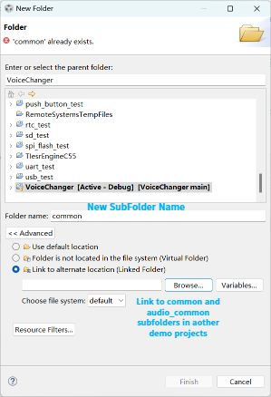

# VoiceChanger_TIDSP 
  
This project uses TI DSP board(BOOST5545ULP) to realize the real-time voice changing system based on the principle of fractional frequency conversion
## Preconditon
+ Please make sure you've went through **[C5545 DSP BoosterPack Software User’s Guide](https://www.ti.com.cn/cn/lit/pdf/sprui92)**,and you can build or debug demos **[C5545 DSP BoosterPack Software Installer 01.01.00.00](https://www.ti.com.cn/cn/lit/zip/sprcae7)**.  
   
+ Download this project and import it to ccs.Then create two new subfolders(`audio_common` and `common`) and link them to counterparts in one of the demos.
+ Moreover,To avoid `gpio_ISR` redefinition conflicts, you need to delete, comment the `gpio_ISR` function in `audio_common.h` or change the `gpio_ISR function` to static like i do.
## How to Run?
+ Just like running other projects in ccs.
  + *Build*  
  + *Launch Target Configuration*(Create a new C5545 Target configuration file if you don't have one)  
  + *Connect Target*(Make sure that the board and PC are normally connected through the debug port and powered on) 
  + *Load Programs*  
  + *Resume*.  
Or you could just simply hit the *Debug* button,The pitch of the sound input from the onboard mic will be lowered and output from the headphone port, you should be able to hear it when you plug in headphones or speakers.
+ The program has a set of simple control logic. Press `sw2` button to pause or resume playback, press `sw3` to turn off or turn on the voice changing effect, press `sw4` to change the upsampling or downsampling working mode.The three are independent of each other.
+ Voice changing effect adjustment: In `dma.h`,there are two Macros(`A` and `B`),the output sound pitch will rise or fall by `B/A`.So you can manipulate these two parameters to achieve different voice changing effects.By default,`B/A = 3/2`.
## System Architecture
  
The above diagram illustrates the system architecture.Some parameters need to be specified as follows
+ Sampling Rate:48KHz
+ Bit depth:16 bits
+ PingPong buffer Size: 512 words
+ System Clock:100MHz  
Moreover,In order to eliminate the frequency components brought by downsampling, we designed an `11th-order` low-pass FIR filter with a cutoff frequency of `pi/8` in matlab.The filter will only work when downsampling.FIR filter related functions and parameters are in the `fir.c` and `fir.h`, you can also adjust the filter yourself.
## Explanation
This project is an assignment in the DSP practical course.So the time is a bit rushed, the code is modified based on the routine, some places are not standardized, please forgive me.  
If you have any questions, you can ask them in Issues, and pull requests for improvements are also welcome.
